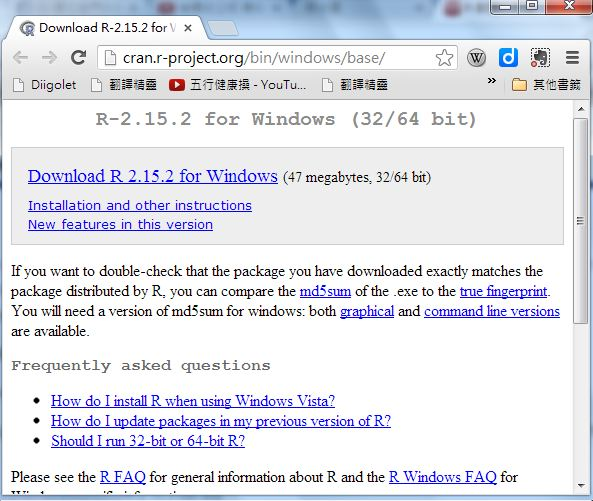
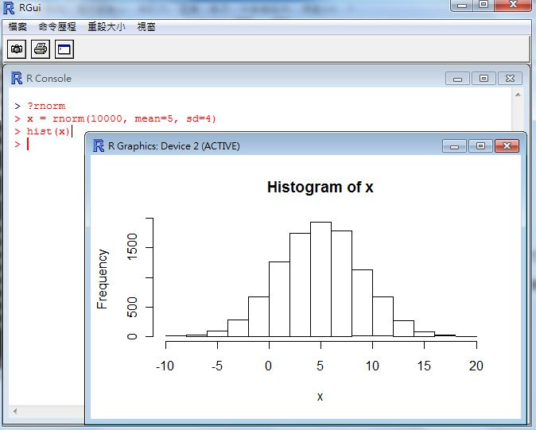

## R 統計軟體：(1) 簡介與基本操作 -- (作者：陳鍾誠)

### 簡介

R 軟體是專門為了機率統計而設計的一種開放原始碼軟體，是免費的自由軟體。

市面上有許多與 R 類似的商用軟體，像是 SPSS, SAS, MINITAB, S-PLUS 等，但是這些軟體是要花錢買的。

R 軟體所使用的程式語言，被稱為 R 語言。

R 語言 與 S-PLUS 所使用的語言很類似，兩者都衍生自貝爾實驗室 Rick Becker, Allan Wilks, John Chambers 所創造的 S 語言，R 語言基本上是 GNU 所實作的 S 語言版本。

筆者篆寫此文時，R 所採用的 S 語言演化到了第四版，因此稱為 S4。

### 安裝

R 軟體的官方網站為 <http://www.r-project.org/>，其中有個相當重要的子網站稱為 CRAN (Comprehensive R Archive Network)，其網址為 <http://cran.r-project.org/>，您可以從這個網站中下載 R 軟體。

舉例而言，筆者使用的是 Windows作業系統，因此可以從以下網址下載到最新版的 R 軟體。

* <http://cran.r-project.org/bin/windows/base/>



舉例而言，筆者點選時為 Download R 2.15.2 for Windows 這個連結， 這會下載位於下列網址的檔案：

* <http://cran.r-project.org/bin/windows/base/R-2.15.2-win.exe>

下載完畢後，請啟動該安裝檔，然後不斷按「下一步」就可以完成安裝了，過程非常簡單。

以下網址中的 Youtube 影片介紹了 R 軟體的下載、安裝、套件、網站、電子書等等，有興趣的朋友可以看看。

* <http://www.youtube.com/watch?v=AipnE4s8sKk>

### 基本操作

為了說明 R 軟體的用法，並用以學習機率統計的概念，本系列文章將運用 R 來說明機率統計的理論，讓程式人可以透過實作學會機率統計，並且學會 R 軟體中的 S 語言。

為了避免太過枯燥，我們將不會先介紹 R 的基本語法，而是先用一系列的操作，讓讀者體會 R 的能力，然後再慢慢回到語言的教學上面。

以下是筆者用 R 軟體取樣後會出樣本統計圖的畫面，簡單的幾個指令就可以得到統計結果，是不是很棒呢？



第一個指令 `?rnorm` 是要求 R 軟體查詢 rnorm 這個指令，R 軟體會顯示以下的說明網頁，您可以看到 rnorm 指令是與常態分部 (The Normal Distribution) 有關的。


在 R 軟體中，對於任何一個機率分布 xxxx，都會實作出以 d, p, q, r 為字首的四種函數，例如對於常態分布 Normal Distribution (簡寫為 norm) 而言，就有 dnorm, pnorm, qnorm, rnorm 等四個函數，功能分別如下所示：

函數            說明                            語法
--------        -------------------------       -----------------------------------------------------------------
dnorm           常態分布的機密度函數            dnorm(x, mean = 0, sd = 1, log = FALSE)
pnorm           常態分布的機分布函數            pnorm(q, mean = 0, sd = 1, lower.tail = TRUE, log.p = FALSE)
qnorm           常態分布的分位數函數            qnorm(p, mean = 0, sd = 1, lower.tail = TRUE, log.p = FALSE)
rnorm           常態分布隨機樣本函數            rnorm(n, mean = 0, sd = 1)

上表中的 mean 代表平均數，sd 代表 Standard Deviation (標準差)，n 是隨機產生的樣本個數，x 是隨機變數值，q 是累積值，p 是機率值，n 則是產生的樣本數。

您可以發現函數中，有些參數後面有 = 的指定 (像是 mean=0, sd=1, log=FALSE, ....)，有些卻沒有 (像是 x, q, p, n) 等，這些指定代表預設值，也就是如果您不指定這些參數的値，那麼將會自動代入預設值。

所以 `rnorm(100)` 代表 `rnorm(100, mean = 0, sd = 1)` 的意思，也就是該函數會產生平均數為 mean=0，標準差為 sd=1 的隨機樣本共 100 個。

關於這些函數的更詳細的說明如下表所示。

字首        函數意義            範例                     說明
------      -----------------   -------------------      -----------------------------------------------------------------
d           機率密度函數        dnorm(1.96)              P(X=x)
p           累積機率函數(CDF)   pnorm(1.96)=0.975        P(X≤x)
q           計算百分位數        qnorm(0.975)=1.96        q 系列為 p 系列的反函數; 所以 qnorm(pnorm(1.96)) = 1.96
r           抽樣函數            rnorm(100)               傳回 100 個標準常態分布的樣本向量

看懂這些函數之後，讓我們再度列出上圖的操作指令，仔細觀察看看每一個指令的意義。

```R
?rnorm

x = rnorm(10000, mean=5, sd=4)

hist(x)
```

指令 `x = rnorm(10000, mean=5, sd=4)` 代表我們要用平均值為 5, 標準差為 4 的常態分布，隨機產生 10000 個樣本，然後將這些樣本存到 x 陣列當中。

指令 `hist(x)` 代表要用這些樣本畫出統計的直方圖 (Histogram)，於是就畫出了圖中的那個長條狀圖形。

現在、請讀者試著看看下列操作，看看您是否能夠讀懂這些操作的意義。

```R
rnorm(10, 3, 2)
> x
 [1] 2.5810213 0.5399127 5.0005020 5.3402693 2.7900723 3.9638088 5.2119685
 [8] 2.2209882 2.9935943 7.0308419
> a=dnorm(1.96)
> a
[1] 0.05844094
> b=pnorm(1.96)
> b
[1] 0.9750021
> c=qnorm(b)
> c
[1] 1.96
> d=rnorm(10)
> d
 [1] -0.32913677  0.77788306 -1.80862496  0.16694598 -0.65656254 -1.76305925
 [7]  1.18237502  0.19651748 -0.07898685  0.73970933
> 
```

在下一期當中，我們將會用 R 統計軟體，示範如何進行敘述統計的操作，並說明這些操作的意義，我們下期見！
